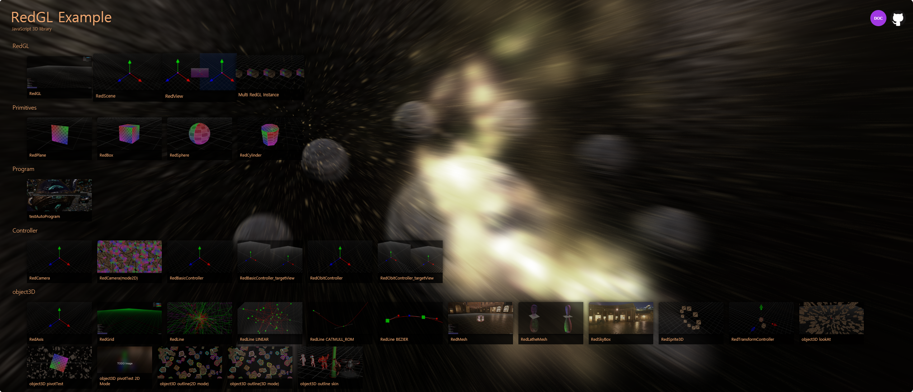

# RedGL
[](LICENSE)

## JavaScript 3D library

The main goal of this project is to create a WebGL library that will perform optimally on all browsers / devices (PC, Mobile).

## [Release Notes](https://github.com/redcamel/RedGL2/releases) 
 - [Release Note V7.0](https://github.com/redcamel/RedGL2/releases/tag/Master_V7.0)
 - [Release Note V6.0](https://github.com/redcamel/RedGL2/releases/tag/Master_V6.0)
 - [Release Note V5.0](https://github.com/redcamel/RedGL2/releases/tag/Master_V5.0)
 - [Release Note V4.0](https://github.com/redcamel/RedGL2/releases/tag/Master_V4.0)
 - [Release Note V3.0](https://github.com/redcamel/RedGL2/releases/tag/Master_V3.0)
 - [Release Note V2.0](https://github.com/redcamel/RedGL2/releases/tag/Master_V2.0)

## [Documentation](https://redcamel.github.io/RedGL2/redDoc/index.html)

## [Examples](https://redcamel.github.io/RedGL2/example/index.html)
   - See the [example](https://redcamel.github.io/RedGL2/example/index.html). Various examples are available.
   
   

## [TestCase](https://redcamel.github.io/RedGL2/testCase/index.html)

## Usage
```html
<script src="https://redcamel.github.io/RedGL2/release/RedGL.min.js"></script>
```
```javascript
var canvas;
canvas = document.createElement('canvas');
document.body.appendChild(canvas);
RedGL(canvas, function (v) {
    if (v) {
        console.log('Initialization successful!');
        var tWorld, tView, tScene, tController, tRenderer;
        
        // create RedWorld Instance
        this['world'] = tWorld = RedWorld();
        
        // create RedScene Instance
        tScene = RedScene(this);
        
        // create camera
        tController = RedObitController(this);
        tController.pan = 45;
        tController.tilt = -45;
        
        // create RedRenderer
        tRenderer = RedRenderer();
        
        // create a RedView instance and add to the RedWorld instance
        tView = RedView('HelloRedGL', this, tScene, tController);
        tWorld.addView(tView);
        
        // set grid debuger
        tScene['grid'] = RedGrid(this);
        
        // set axis debuger
        tScene['axis'] = RedAxis(this);
        
        // start rendering
        tRenderer.start(this, function (time) {
          console.log(time)
        });
        
        // set renderDebugPanel
        tRenderer.setDebugButton();
        console.log(this);
    } else {
        alert('Initialization fail!')
    }
});
```

## How to build your own RedGL

```sh
git clone git@github.com:redcamel/RedGL2.git
cd RedGL2
npm install
npm run build
# You can see the built RedGL files in the `release` folder.
```
This project is maintained by [RedCamel](mailto:webseon@gmail.com)
